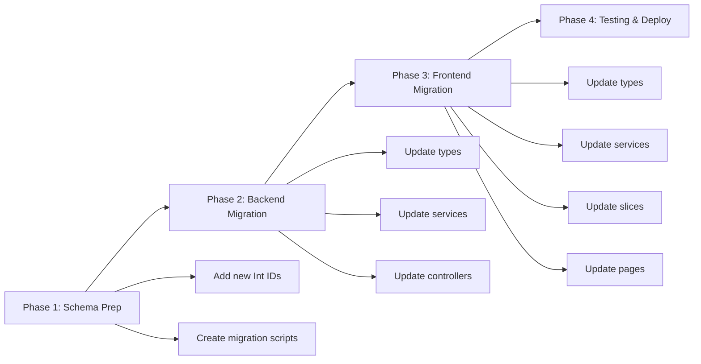

# UUID to Int ID Migration Plan

## Executive Summary

This document outlines the migration plan to convert all UUID-based IDs to auto-incrementing Int IDs across the entire application. This is a **breaking change** that requires careful coordination across database, backend, and frontend layers.

**Impact Level:** 🔴 HIGH - Breaking change requiring data migration

**Estimated Scope:**
- 9 Prisma models with 23 ID fields
- 20+ backend files (types, services, controllers)
- 30+ frontend files (types, services, slices, pages)
- Database migration with data preservation

---

## Current State Analysis

### Schema Overview

| Model | Primary ID | Foreign Keys | Total ID Fields |
|-------|-----------|--------------|----------------|
| User | 1 | 6 | 7 |
| POL | 1 | 1 | 2 |
| POLDetail | 1 | 1 | 2 |
| ProductionRecord | 1 | 2 | 3 |
| DecorationTask | 1 | 1 | 2 |
| DiscrepancyAlert | 1 | 4 | 5 |
| LogbookEntry | 1 | 3 | 4 |
| RevisionTicket | 1 | 3 | 4 |
| ActivityLog | 1 | 1 | 2 |
| **TOTAL** | **9** | **22** | **31** |

### ID Field Changes Required

**Pattern:**
```prisma
// BEFORE
id            String    @id @default(uuid())
foreignKeyId  String

// AFTER
id            Int       @id @default(autoincrement())
foreignKeyId  Int
```

---

## Migration Strategy

### Approach: **Sequential Migration with Data Preservation**

We'll use a **three-phase approach** to minimize downtime and ensure data integrity:



---

## Phase 1: Schema & Database Migration

### 1.1 Update Prisma Schema

**File:** `backend/prisma/schema.prisma`

**Changes by Model:**

#### 1. User Model
```prisma
model User {
  id            Int       @id @default(autoincrement())  // Changed
  username      String    @unique
  email         String?   @unique @map("email")
  passwordHash  String?   @map("password")
  fullName      String?   @map("fullName")
  role          UserRole  @default(WORKER)
  createdAt     DateTime  @default(now()) @map("createdAt")
  updatedAt     DateTime? @map("updatedAt")
  lastLogin     DateTime? @map("lastLogin")
  isActive      Boolean   @default(true) @map("isActive")
  
  // Relationships - Foreign keys updated
  createdBy     Int       @map("createdBy")  // Changed
  // ... other relationships
  
  @@map("users")
}
```

#### 2. POL Model
```prisma
model POL {
  id            Int       @id @default(autoincrement())  // Changed
  poNumber      String    @unique @map("polNumber")
  clientName    String    @map("customerName")
  poDate        DateTime  @default(now()) @map("orderDate")
  deliveryDate  DateTime  @map("deliveryDate")
  status        POLStatus @default(DRAFT)
  notes         String?   @map("notes")
  createdBy     Int       @map("createdBy")  // Changed
  createdAt     DateTime  @default(now()) @map("createdAt")
  updatedAt     DateTime? @default(now()) @updatedAt @map("updatedAt")
  
  // Relationships
  creator       User?     @relation("POLCreatedBy", fields: [createdBy], references: [id])
  // ...
  
  @@map("pols")
}
```

#### 3. POLDetail Model
```prisma
model POLDetail {
  id             Int         @id @default(autoincrement())  // Changed
  polId          Int         @map("polId")  // Changed
  productCode    String      @map("productCode")
  productName    String      @map("productName")
  quantity       Int
  extraBuffer    Int         @default(15) @map("extraBuffer")
  productType    ProductType @default(PLAIN) @map("productType")
  color          String?
  texture        String?
  material       String?
  size           String?
  finalSize      String?     @map("finalSize")
  notes          String?
  createdAt      DateTime    @default(now()) @map("createdAt")
  updatedAt      DateTime    @updatedAt @map("updatedAt")
  
  // Relationships
  pol            POL         @relation(fields: [polId], references: [id], onDelete: Cascade)
  // ...
  
  @@map("pol_details")
}
```

#### 4. ProductionRecord Model
```prisma
model ProductionRecord {
  id              Int             @id @default(autoincrement())  // Changed
  polDetailId     Int             @map("pol_detail_id")  // Changed
  stage           ProductionStage
  quantity        Int
  rejectQuantity  Int             @default(0) @map("reject_quantity")
  remakeCycle     Int             @default(0) @map("remake_cycle")
  notes           String?
  createdBy       Int             @map("created_by")  // Changed
  createdAt       DateTime        @default(now()) @map("createdAt")
  updatedAt       DateTime        @updatedAt @map("updatedAt")
  
  // Relationships
  polDetail       POLDetail       @relation(fields: [polDetailId], references: [id], onDelete: Cascade)
  user            User            @relation(fields: [createdBy], references: [id])
  
  @@map("production_records")
}
```

#### 5. DecorationTask Model
```prisma
model DecorationTask {
  id                Int       @id @default(autoincrement())  // Changed
  polDetailId       Int       @map("pol_detail_id")  // Changed
  taskName          String    @map("task_name")
  taskDescription   String?   @map("task_description")
  quantityRequired  Int       @default(0) @map("quantity_required")
  quantityCompleted Int       @default(0) @map("quantity_completed")
  quantityRejected  Int       @default(0) @map("quantity_rejected")
  status            String    @default("PENDING")
  notes             String?
  createdBy         Int?      @map("created_by")  // Changed
  completedAt       DateTime? @map("completed_at")
  createdAt         DateTime  @default(now()) @map("createdAt")
  updatedAt         DateTime  @updatedAt @map("updatedAt")
  
  // Relationships
  polDetail         POLDetail @relation(fields: [polDetailId], references: [id], onDelete: Cascade)
  
  @@map("decoration_tasks")
}
```

#### 6. DiscrepancyAlert Model
```prisma
model DiscrepancyAlert {
  id               Int            @id @default(autoincrement())  // Changed
  polId            Int            @map("pol_id")  // Changed
  polDetailId      Int            @map("pol_detail_id")  // Changed
  stage            ProductionStage
  expectedQuantity Int            @map("expected_quantity")
  actualQuantity   Int            @map("actual_quantity")
  difference       Int
  alertType        String         @map("alert_type")
  alertMessage     String         @map("alert_message")
  priority         AlertPriority  @default(WARNING)
  status           AlertStatus    @default(OPEN)
  reportedBy       Int            @map("reported_by")  // Changed
  acknowledgedBy   Int?           @map("acknowledged_by")  // Changed
  acknowledgedAt   DateTime?      @map("acknowledged_at")
  resolvedBy       Int?           @map("resolved_by")  // Changed
  resolvedAt       DateTime?      @map("resolved_at")
  resolutionNotes  String?        @map("resolution_notes")
  createdAt        DateTime       @default(now()) @map("createdAt")
  updatedAt        DateTime       @updatedAt @map("updatedAt")
  
  // Relationships
  pol               POL            @relation(fields: [polId], references: [id], onDelete: Cascade)
  polDetail         POLDetail      @relation(fields: [polDetailId], references: [id], onDelete: Cascade)
  reportedByUser    User           @relation("AlertReportedBy", fields: [reportedBy], references: [id])
  acknowledgedByUser User?         @relation("AlertAcknowledgedBy", fields: [acknowledgedBy], references: [id])
  resolvedByUser    User?          @relation("AlertResolvedBy", fields: [resolvedBy], references: [id])
  
  @@map("discrepancy_alerts")
}
```

#### 7. LogbookEntry Model
```prisma
model LogbookEntry {
  id            Int        @id @default(autoincrement())  // Changed
  polId         Int?       @map("pol_id")  // Changed
  polDetailId   Int?       @map("pol_detail_id")  // Changed
  stage         String?
  issueType     IssueType  @map("issue_type")
  description   String
  severity      Severity
  resolution    String?
  status        LogStatus  @default(OPEN)
  createdBy     Int        @map("created_by")  // Changed
  createdAt     DateTime   @default(now()) @map("createdAt")
  updatedAt     DateTime   @updatedAt @map("updatedAt")
  
  // Relationships
  pol           POL?       @relation(fields: [polId], references: [id])
  polDetail     POLDetail? @relation(fields: [polDetailId], references: [id])
  user          User       @relation(fields: [createdBy], references: [id])
  
  @@map("logbook_entries")
}
```

#### 8. RevisionTicket Model
```prisma
model RevisionTicket {
  id                Int             @id @default(autoincrement())  // Changed
  ticketNumber      String          @unique @map("ticket_number")
  polId             Int             @map("pol_id")  // Changed
  polDetailId       Int?            @map("pol_detail_id")  // Changed
  createdBy         Int             @map("created_by")  // Changed
  revisionType      RevisionType    @map("revision_type")
  issueType         String          @map("issue_type")
  severity          Severity
  description       String
  reason            String
  impactAssessment  String?         @map("impact_assessment")
  status            RevisionStatus  @default(DRAFT)
  submittedAt       DateTime?       @map("submitted_at")
  approvedBy        Int?            @map("approved_by")  // Changed
  approvedAt        DateTime?       @map("approved_at")
  managerNotes      String?         @map("manager_notes")
  createdAt         DateTime        @default(now()) @map("createdAt")
  updatedAt         DateTime        @updatedAt @map("updatedAt")
  
  // Relationships
  pol               POL             @relation(fields: [polId], references: [id])
  polDetail         POLDetail?      @relation(fields: [polDetailId], references: [id])
  creator           User            @relation("RevisionCreatedBy", fields: [createdBy], references: [id])
  approvedByUser    User?           @relation("RevisionApprovedBy", fields: [approvedBy], references: [id])
  
  @@map("revision_tickets")
}
```

#### 9. ActivityLog Model
```prisma
model ActivityLog {
  id          Int      @id @default(autoincrement())  // Changed
  userId      Int      @map("user_id")  // Changed
  action      String
  entityType  String   @map("entity_type")
  entityId    Int?     @map("entity_id")  // Changed
  details     String?
  ipAddress   String?  @map("ip_address")
  userAgent   String?  @map("user_agent")
  createdAt   DateTime @default(now()) @map("createdAt")
  
  // Relationships
  user        User     @relation(fields: [userId], references: [id])
  
  @@map("activity_logs")
}
```

### 1.2 Generate Migration

```bash
cd backend
npx prisma migrate dev --name uuid_to_int_migration
```

**Expected Output:**
- Creates new migration file in `prisma/migrations/`
- Updates database schema
- **IMPORTANT:** This will drop and recreate tables, requiring data migration

### 1.3 Data Migration Strategy

**Option A: Fresh Database (Recommended for Development)**
- Export existing data
- Apply schema changes
- Re-import data with new IDs
- Update foreign key references

**Option B: Incremental Migration (Recommended for Production)**
- Add new Int ID columns alongside existing UUID columns
- Populate Int IDs with sequential values
- Update foreign key references gradually
- Drop old UUID columns after verification

**Data Migration Script Template:**
```sql
-- Example for User table
ALTER TABLE users ADD COLUMN new_id SERIAL PRIMARY KEY;
UPDATE users SET new_id = nextval('users_new_id_seq');
-- Update all foreign key references
UPDATE pols SET "createdBy" = (SELECT new_id FROM users WHERE id = pols."createdBy");
-- ... repeat for all tables
-- Drop old columns
ALTER TABLE users DROP COLUMN id;
ALTER TABLE users RENAME COLUMN new_id TO id;
```

---

## Phase 2: Backend Migration

### 2.1 Update Type Definitions

**File:** `backend/src/types/index.ts`

**Changes Required:**
- Update all ID types from `string` to `number`
- Update interface definitions for all models

**Example:**
```typescript
// BEFORE
export interface User {
  id: string;
  username: string;
  email?: string;
  // ...
}

// AFTER
export interface User {
  id: number;
  username: string;
  email?: string;
  // ...
}
```

### 2.2 Update Services

**Files to Update:**
- `backend/src/services/auth.service.ts`
- `backend/src/services/pol.service.ts`
- `backend/src/services/product.service.ts`
- `backend/src/services/production.service.ts`
- `backend/src/services/decoration.service.ts`
- `backend/src/services/alert.service.ts`
- `backend/src/services/logbook.service.ts`
- `backend/src/services/revision.service.ts`
- `backend/src/services/report.service.ts`

**Common Changes:**
- Update function signatures accepting ID parameters
- Update type assertions for ID fields
- Update Prisma query filters

**Example:**
```typescript
// BEFORE
async getUserById(id: string): Promise<User | null> {
  return prisma.user.findUnique({ where: { id } });
}

// AFTER
async getUserById(id: number): Promise<User | null> {
  return prisma.user.findUnique({ where: { id } });
}
```

### 2.3 Update Controllers

**Files to Update:**
- All route handlers in `backend/src/routes/`

**Common Changes:**
- Update request parameter parsing for IDs
- Update response types
- Update validation schemas

**Example:**
```typescript
// BEFORE
router.get('/users/:id', async (req, res) => {
  const { id } = req.params; // string
  const user = await userService.getUserById(id);
  // ...
});

// AFTER
router.get('/users/:id', async (req, res) => {
  const { id } = req.params;
  const userId = parseInt(id, 10); // Convert to number
  const user = await userService.getUserById(userId);
  // ...
});
```

### 2.4 Update Middleware

**File:** `backend/src/middleware/auth.middleware.ts`

**Changes Required:**
- Update JWT payload handling for user IDs
- Update type assertions

### 2.5 Update Seed File

**File:** `backend/prisma/seed.ts`

**Changes Required:**
- Update all seed data to use Int IDs
- Update foreign key references in seed data

---

## Phase 3: Frontend Migration

### 3.1 Update Type Definitions

**File:** `frontend/src/types/index.ts`

**Changes Required:**
- Update all ID types from `string` to `number`
- Update interface definitions for all models

**Example:**
```typescript
// BEFORE
export interface User {
  id: string;
  username: string;
  email?: string;
  // ...
}

export interface POL {
  id: string;
  poNumber: string;
  createdBy: string;
  // ...
}

// AFTER
export interface User {
  id: number;
  username: string;
  email?: string;
  // ...
}

export interface POL {
  id: number;
  poNumber: string;
  createdBy: number;
  // ...
}
```

### 3.2 Update API Services

**Files to Update:**
- `frontend/src/services/api.ts`
- `frontend/src/services/auth.service.ts`
- `frontend/src/services/pol.service.ts`
- `frontend/src/services/production.service.ts`
- `frontend/src/services/alert.service.ts`
- `frontend/src/services/logbook.service.ts`
- `frontend/src/services/revision.service.ts`
- `frontend/src/services/report.service.ts`

**Common Changes:**
- Update API call parameters to send numbers instead of strings
- Update response type assertions
- Update URL path parameters

**Example:**
```typescript
// BEFORE
export const getPOL = async (id: string): Promise<POL> => {
  const response = await api.get(`/pols/${id}`);
  return response.data;
};

// AFTER
export const getPOL = async (id: number): Promise<POL> => {
  const response = await api.get(`/pols/${id}`);
  return response.data;
};
```

### 3.3 Update Redux Slices

**Files to Update:**
- `frontend/src/store/slices/authSlice.ts`
- `frontend/src/store/slices/polSlice.ts`
- `frontend/src/store/slices/productionSlice.ts`
- `frontend/src/store/slices/alertSlice.ts`
- `frontend/src/store/slices/reportSlice.ts`
- `frontend/src/store/slices/uiSlice.ts`

**Common Changes:**
- Update state types
- Update action payload types
- Update reducer logic

**Example:**
```typescript
// BEFORE
interface POLState {
  pols: POL[];
  selectedPOL: string | null;
  loading: boolean;
  error: string | null;
}

// AFTER
interface POLState {
  pols: POL[];
  selectedPOL: number | null;
  loading: boolean;
  error: string | null;
}
```

### 3.4 Update Pages and Components

**Files to Update:**
- `frontend/src/pages/POLList.tsx`
- `frontend/src/pages/POLManagement.tsx`
- `frontend/src/pages/POLCreate.tsx`
- `frontend/src/pages/POLDetail.tsx`
- `frontend/src/pages/ProductionTracking.tsx`
- `frontend/src/pages/AlertCenter.tsx`
- `frontend/src/pages/Alerts.tsx`
- `frontend/src/pages/Logbook.tsx`
- `frontend/src/pages/RevisionTickets.tsx`
- `frontend/src/pages/Reports.tsx`
- `frontend/src/pages/Dashboard.tsx`
- `frontend/src/pages/Settings.tsx`

**Common Changes:**
- Update ID handling in event handlers
- Update conditional rendering based on IDs
- Update navigation with ID parameters
- Update form handling for ID fields

**Example:**
```typescript
// BEFORE
const handlePOLClick = (polId: string) => {
  navigate(`/pols/${polId}`);
};

// AFTER
const handlePOLClick = (polId: number) => {
  navigate(`/pols/${polId}`);
};
```

### 3.5 Update URL Parameter Handling

**Files with Route Parameters:**
- All pages using `useParams()` hook

**Changes Required:**
- Convert string route parameters to numbers

**Example:**
```typescript
// BEFORE
const { id } = useParams<{ id: string }>();
const pol = useAppSelector(state => state.pol.selectedPOL);

// AFTER
const { id } = useParams<{ id: string }>();
const polId = parseInt(id || '0', 10);
const pol = useAppSelector(state => state.pol.selectedPOL);
```

---

## Phase 4: Testing & Deployment

### 4.1 Backend Testing

**Unit Tests:**
- Test all service functions with number IDs
- Test ID validation and parsing
- Test foreign key relationships

**Integration Tests:**
- Test API endpoints with number IDs
- Test CRUD operations
- Test relationship queries

**Manual Testing Checklist:**
- [ ] User authentication works
- [ ] POL creation and retrieval
- [ ] Production record tracking
- [ ] Alert system functionality
- [ ] Logbook entries
- [ ] Revision tickets
- [ ] Reports generation

### 4.2 Frontend Testing

**Component Testing:**
- Test all components with number IDs
- Test ID-based conditional rendering
- Test navigation with ID parameters

**E2E Testing:**
- Test complete user flows
- Test ID-based operations
- Test error handling

**Manual Testing Checklist:**
- [ ] Login/logout works
- [ ] POL list displays correctly
- [ ] POL details page loads
- [ ] Production tracking updates
- [ ] Alert center functions
- [ ] All forms submit correctly

### 4.3 Deployment Strategy

**Staging Deployment:**
1. Deploy backend changes
2. Run database migration
3. Deploy frontend changes
4. Test thoroughly

**Production Deployment:**
1. **CRITICAL:** Schedule maintenance window
2. Backup database
3. Deploy backend changes
4. Run database migration
5. Deploy frontend changes
6. Verify all functionality
7. Monitor for issues

**Rollback Plan:**
- Keep backup of pre-migration database
- Have previous version of backend and frontend ready
- Document rollback procedure

---

## Risk Assessment

### High Risk Areas

| Risk | Impact | Mitigation |
|------|--------|------------|
| Data loss during migration | Critical | Full database backup before migration |
| API breaking changes | High | Version API or coordinate frontend/backend deployment |
| Foreign key constraint failures | High | Test migration on staging first |
| Client-side ID parsing errors | Medium | Comprehensive testing |
| Performance degradation | Low | Monitor query performance |

### Known Issues

1. **JWT Tokens:** Existing JWT tokens with UUID user IDs will become invalid. Users will need to re-authenticate.
2. **Cached Data:** Any client-side cached data with UUID IDs will be invalid.
3. **External Integrations:** Any external systems referencing UUID IDs will need updates.

---

## Rollback Procedure

If issues arise post-migration:

1. Stop application services
2. Restore database from backup
3. Revert backend to previous version
4. Revert frontend to previous version
5. Restart services
6. Verify functionality

---

## Success Criteria

Migration is considered successful when:

- ✅ All database tables have Int IDs with autoincrement
- ✅ All foreign key relationships work correctly
- ✅ Backend API endpoints accept and return number IDs
- ✅ Frontend correctly handles number IDs
- ✅ All user flows work end-to-end
- ✅ No data loss or corruption
- ✅ Performance is acceptable
- ✅ All tests pass

---

## Appendix: File Checklist

### Schema Files
- [ ] `backend/prisma/schema.prisma`

### Backend Files
- [ ] `backend/src/types/index.ts`
- [ ] `backend/src/services/auth.service.ts`
- [ ] `backend/src/services/pol.service.ts`
- [ ] `backend/src/services/product.service.ts`
- [ ] `backend/src/services/production.service.ts`
- [ ] `backend/src/services/decoration.service.ts`
- [ ] `backend/src/services/alert.service.ts`
- [ ] `backend/src/services/logbook.service.ts`
- [ ] `backend/src/services/revision.service.ts`
- [ ] `backend/src/services/report.service.ts`
- [ ] `backend/src/routes/auth.routes.ts`
- [ ] `backend/src/routes/pol.routes.ts`
- [ ] `backend/src/routes/product.routes.ts`
- [ ] `backend/src/routes/production.routes.ts`
- [ ] `backend/src/routes/alert.routes.ts`
- [ ] `backend/src/routes/logbook.routes.ts`
- [ ] `backend/src/routes/revision.routes.ts`
- [ ] `backend/src/routes/report.routes.ts`
- [ ] `backend/src/middleware/auth.middleware.ts`
- [ ] `backend/prisma/seed.ts`

### Frontend Files
- [ ] `frontend/src/types/index.ts`
- [ ] `frontend/src/services/api.ts`
- [ ] `frontend/src/services/auth.service.ts`
- [ ] `frontend/src/services/pol.service.ts`
- [ ] `frontend/src/services/production.service.ts`
- [ ] `frontend/src/services/alert.service.ts`
- [ ] `frontend/src/services/logbook.service.ts`
- [ ] `frontend/src/services/revision.service.ts`
- [ ] `frontend/src/services/report.service.ts`
- [ ] `frontend/src/store/slices/authSlice.ts`
- [ ] `frontend/src/store/slices/polSlice.ts`
- [ ] `frontend/src/store/slices/productionSlice.ts`
- [ ] `frontend/src/store/slices/alertSlice.ts`
- [ ] `frontend/src/store/slices/reportSlice.ts`
- [ ] `frontend/src/store/slices/uiSlice.ts`
- [ ] `frontend/src/pages/Login.tsx`
- [ ] `frontend/src/pages/POLList.tsx`
- [ ] `frontend/src/pages/POLManagement.tsx`
- [ ] `frontend/src/pages/POLCreate.tsx`
- [ ] `frontend/src/pages/POLDetail.tsx`
- [ ] `frontend/src/pages/ProductionTracking.tsx`
- [ ] `frontend/src/pages/AlertCenter.tsx`
- [ ] `frontend/src/pages/Alerts.tsx`
- [ ] `frontend/src/pages/Logbook.tsx`
- [ ] `frontend/src/pages/RevisionTickets.tsx`
- [ ] `frontend/src/pages/Reports.tsx`
- [ ] `frontend/src/pages/Dashboard.tsx`
- [ ] `frontend/src/pages/Settings.tsx`

**Total Files to Update:** ~50 files

---

## Timeline Estimate

| Phase | Tasks | Notes |
|-------|-------|-------|
| Phase 1 | Schema update, migration generation | 2-4 hours |
| Phase 2 | Backend types, services, controllers | 4-6 hours |
| Phase 3 | Frontend types, services, slices, pages | 6-8 hours |
| Phase 4 | Testing, deployment | 4-6 hours |
| **Total** | **~16-24 hours** | Depends on data complexity |

---

## Questions & Considerations

1. **Data Volume:** How much existing data needs to be migrated?
2. **Downtime Tolerance:** Can the application be taken offline for migration?
3. **External Dependencies:** Are there external systems referencing UUID IDs?
4. **Backup Strategy:** What is the backup and restore procedure?
5. **Testing Environment:** Is there a staging environment for testing?

---

## Next Steps

1. ✅ Review this migration plan
2. ✅ Approve or modify the plan
3. ⏭️ Switch to Code mode to implement changes
4. ⏭️ Execute migration phases sequentially
5. ⏭️ Test thoroughly at each phase
6. ⏭️ Deploy to staging
7. ⏭️ Deploy to production

---

**Document Version:** 1.0  
**Last Updated:** 2025-02-23  
**Author:** Kilo Code (Architect Mode)
